# Evanston Restaurant Recommender System Analysis

**STAT 415: Homework 2 - Recommender Systems Part 1**  
**Student Name: Xinhui Qian**  
**Date: April 28, 2025**  

---

## Summary

This report analyzes a dataset of restaurant reviews from Evanston to develop and evaluate recommendation systems using popularity matching, content-based filtering, and natural language analysis approaches. The dataset consists of 68 restaurants with 1,500 reviews(in the sheet `Restaurant` and `Reviews` respectively) that include both restaurant attributes and reviewer demographics.Each recommendation method has distinct strengths, with content-based and natural language analysis approaches providing the most personalized recommendations.

## 1. Exploratory Data Analysis

### 1.1 Dataset Overview 

Restaurants: 68 unique venues with 7 structured attributes (e.g., cuisine, cost) and a free‑text description.
Reviews: 1500 customer reviews containing ratings, review text, and 14 demographic variables.
The visualization of the restaurants on the map is shown as follows:
<div align="center">
  
    <br>
    <em>Figure 1: Restaurants distribution on the map</em>
</div>
<div align="center">
  
  <br>
    <em>Figure 2: Restaurants distribution on the map(Zooming in)</em>
</div>

### 1.2 Data Cleaning and Preprocessing
I discovered the following problems and cleaned the initial dataset:
- 7 duplicated reviews in the dataset is deleted; 
- The `Marital Status` column contained multiple variations of the category single due to typos, so I standardized the category labels.
- `Longitude` contains elements which lacks the negative operator or contains extra comma.
- Two sheets are merged together for the analysis.
- Detected and changed the typos of the restaurant name `Claire's Korner` in the `reviewer` sheets.
- Standardize the date-time format. If the date contains only the month and year, impute the missing day by using the median day of reviews grouped by restaurant.

### 1.3 Missing Values

A significant number of missing values were identified across several variables:

<div align="center">
  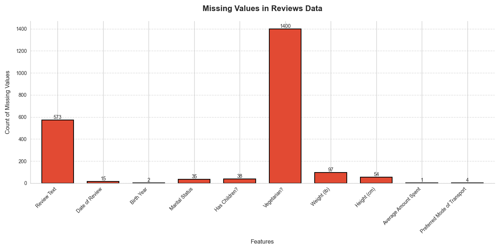
   <br>
    <em>Figure 3: Missing Values Analysis</em>
</div>

**Key findings regarding missing data:**
- **Review Text**: 38.4% missing - This presents a challenge for text-based analysis but doesn't impede rating-based recommendations
- **Vegetarian?**: 93.7% missing - This variable has extremely high missingness and was removed from further analysis
- **Weight/Height**: 6.5% and 3.6% missing - Moderate missingness that can be addressed through imputation
- **Birth Year/Marital Status/Has Children**: Low missingness (0.1-2.5%)

Since this is a recommender system problem, the point is the missing value in the dataset may suggest potential information and the missing values are not at random. So I used the imputation method to deal with the missing data: For categorical values, I impute the missing value with 'Unknown'; for numerical and date data, I impute them with the median of the values conditioned on restaurants.


### 1.2 Data Distribution Analysis

After preprocessing the data, the dataset demonstrates interesting patterns in distribution across key variables:

<div align="center">
  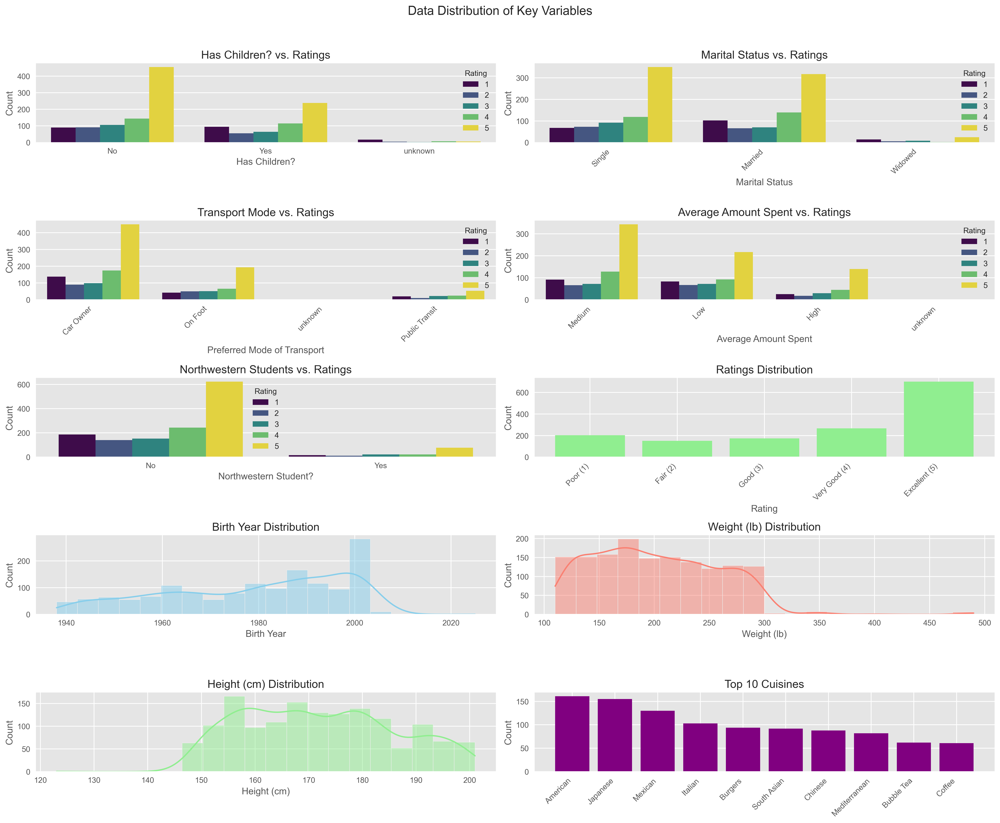
   <br>
    <em>Figure 4: Demographic Statistics Distribution</em>
</div>

<div align="center">
  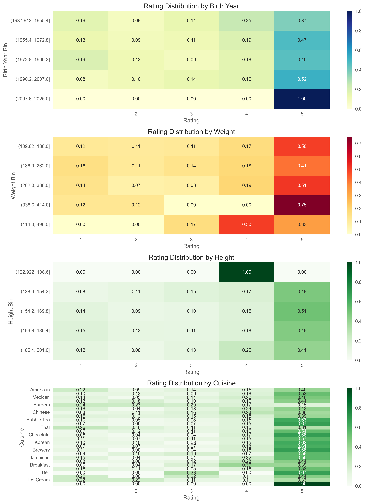
   <br>
    <em>Figure 5: Heatmap of Distribution with respect to ratings</em>
</div>

**Demographic distributions:**

The data is imbalanced in the following aspects:
- **Northwestern Students**: Only 9.9% of reviewers are Northwestern students.
- **Cuisine Types**: American (11.8%), Mexican (10.3%), Japanese (8.8%), South Asia and Burgers are the 5 most common cuisine types.
- **Have Children?** 59% of reviewers don't have children while 38% of reviewers have children. 
- **Preferred Transport**: Car Owner (63.8%), On Foot (27.0%), Public Transit (8.9%)
Also, I discovered some trends in ratings:
- **Rating Distribution**: Strong positive skew with 46.9% giving 5-star ratings. The rating distribution indicates potential positivity bias where users are more likely to leave reviews for restaurants they enjoy.
- **Extreme Rating**: People tend to give extreme scores (5 and 1).
- **Rating by widows**: Widows tend to give low scores(1).
- **Age**: Younger people gives higher scores.

### 1.3 Clustering Analysis

In this session, user demographic data was used to identify distinct segments through clustering. K-Means clustering with 4 clusters (determined through the elbow method) revealed the following user segments. Agglomerative clustering is also used to identify heirarchial features.

To prepare the dataset for clustering, the variable `Average Amount Spent` was first converted into an ordinal feature by mapping its unique values to integers based on their sorted order. Categorical variables including `Marital Status`, `Has Children?`, `Preferred Mode of Transport`, and `Northwestern Student?` were then one-hot encoded without dropping any categories to preserve complete information. Numerical features, specifically `Birth Year`, `Weight (lb)`, `Height (cm)`, and the newly ordinalized `Average Amount Spent`, were standardized using StandardScaler to ensure that all variables contributed equally to distance-based clustering algorithms.

#### 1.3.1 K means clustering

<div align="center">
  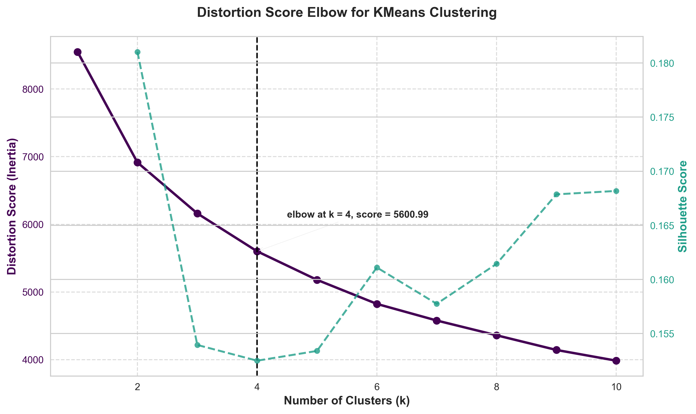
   <br>
    <em>Figure 6: Distortion Score Elbow for KMeans Clustering</em>
</div>
As is shown in figure 6, when the number of cluser switch from 3 to 4, the slope is high while after 4, the slope drops rapidlly and the line becomes flatter. Also, the silhouette score moves within a small range.

<div align="center">
  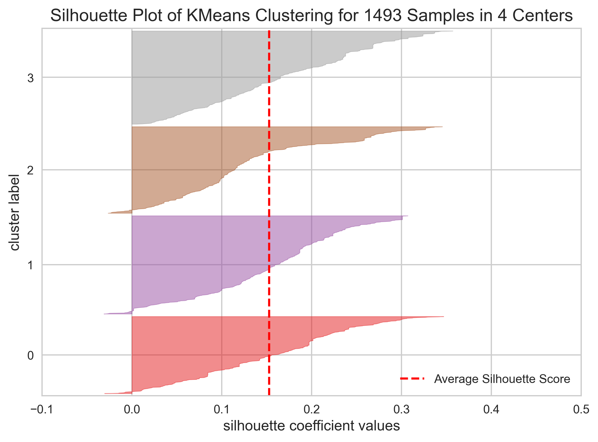
   <br>
    <em>Figure 7: Silhouette_scores</em>
</div>
I choose 4 as the number of groups for clustering. When there are 4 clusters, the average silhouette score is 0.15, indicating fair performance on separations between groups.

<div align="center">
  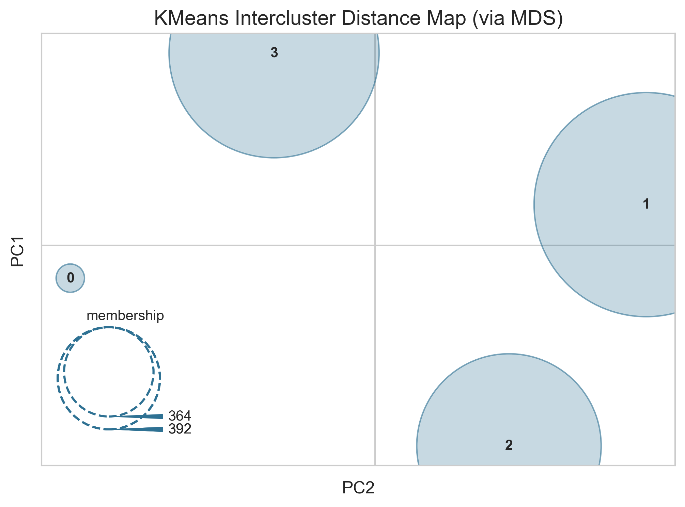
   <br>
    <em>Figure 8: KMeans Intercluster Distance Map</em>
</div>
From the intercluster, although the graph indicates overlap between some points(364 and 392), four groups separate well from each other.
The results is shown as follows.

| Cluster | Avg Rating | Count | Rating Std | Avg Birth Year | % Northwestern Students | % With Children |
|:-------:|:----------:|:-----:|:----------:|:--------------:|:-----------------------:|:---------------:|
|    0    |    3.88     |  324  |    1.36    |     1993.30    |          20.06%          |       5.25%      |
|    1    |    3.64     |  413  |    1.54    |     1969.95    |          0.48%           |      60.53%      |
|    2    |    3.56     |  364  |    1.53    |     1961.06    |          0.27%           |      73.08%      |
|    3    |    3.91     |  392  |    1.38    |     1992.45    |          20.41%          |       9.18%      |

**Key Observations**:
- **Clusters 0 and 3** represent younger populations (early 1990s birth years) with a high proportion of Northwestern students (~20%). And among the young groups, people with children(Cluster 3) tend to give higher ratings compared to people without children(Cluster 0).
- **Clusters 1 and 2** consist of older individuals (average birth years in the 1960s–1970s), most of whom have children (60–73%). Among these two groups, people in Cluster 1 are older than in the other group. Older group (Cluster 2) tend to be more picky and give lower ratings.

#### 1.3.2 Agglomerative clustering 
<div align="center">
  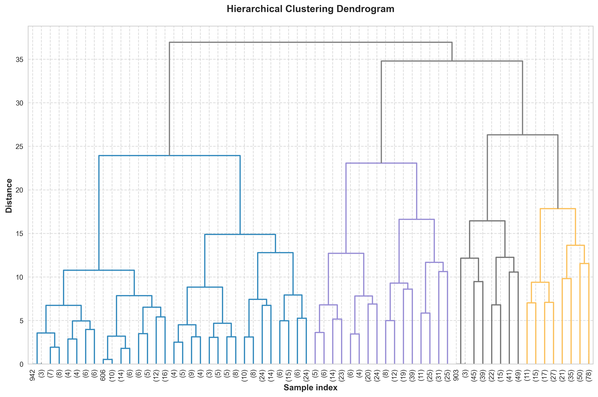
   <br>
    <em>Figure 9: Hierarchial Clustering Dandrogram</em>
</div>


Also I use Agglomerative clustering to validate and compare between different methods.
The results is shown as follows.

| Cluster | Avg Rating | Count | Rating Std | Avg Birth Year | % Northwestern Students | % With Children |
|:-------:|:----------:|:-----:|:----------:|:--------------:|:-----------------------:|:---------------:|
|    0    |    3.71     |  320  |    1.47    |     1971.17    |          2.19%           |      56.56%      |
|    1    |    3.81     |  416  |    1.47    |     1992.72    |         18.99%           |       1.20%      |
|    2    |    3.65     |  536  |    1.49    |     1967.08    |          1.68%           |      69.40%      |
|    3    |    3.90     |  221  |    1.37    |     1991.80    |         23.98%           |       4.98%      |

**Key Observations**:
- Similar to K-Means, the clustering separates younger Northwestern students from older individuals with families.
- I choose cluster = 4 based on Hierarchial Clustering Histogram. Slightly different compositions but the takeway is exactly the same.

#### 1.3.3 Method Comparison

<div align="center">
  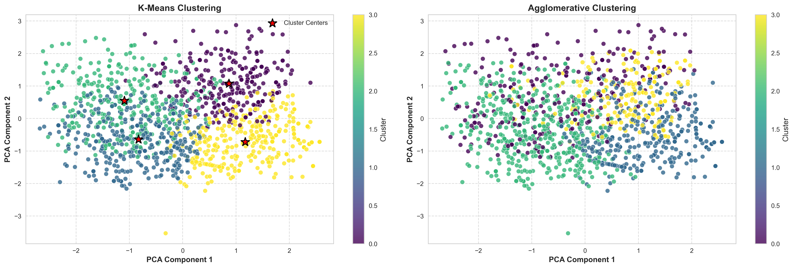
   <br>
    <em>Figure 10: Comparison of Clustering Perfomance on the PCA-reduced space</em>
</div>


By comparing the method, K-Means is a better approach. K-Means performed better in this dataset, showing clearer and more compact clusters. Agglomerative Clustering struggles with this PCA-reduced space, showing overlapping and fuzzier cluster borders.

---

## 2. Popularity Matching

### 2.1 Top-Rated and Most-Reviewed Restaurants

In this session, I first calculated the mean rating score and counts of reviews between restaurants and cuisines.

The restaurant with the highest average rating is Evanston Games & Cafe, achieving a perfect score of 5.00 out of 5.0, compared to the overall dataset average of 3.75. Meanwhile, Campagnola received the most reviews, totaling 48, whereas the median number of reviews per restaurant in the dataset is 22.5. However, it is important to note that Evanston Games & Cafe's perfect rating is based on only a single review, suggesting potential rating inflation, while Campagnola, despite being the most-reviewed, maintains a strong but not flawless average score of 4.00 out of 5.0.


### 2.2 Cuisine-Based Recommendations

A simple popularity-based engine was developed to recommend restaurants by the following criteria:

```math
\text{Popularity Score} = \text{Average Rating} \times \left(\frac{\text{Restaurant Review Count}}{\text{Total Reviews in Cuisine}}\right)
```
where:
- `Average Rating`: The restaurant's average rating score
- `Restaurant Review Count`: Number of reviews received by the restaurant
- `Total Reviews in Cuisine`: Sum of all reviews for restaurants in that cuisine category

The top recommendations based on this criteria in each `Cuisine` category is listed in `Appendix A`.

### 2.3 Shrinkage Estimator Implementation

To address the problem of restaurants with few reviews having extreme ratings, a shrinkage estimator was implemented:

$$
\frac{N_{\mu} \cdot \mu_{s} + N_{p} \cdot \mu_{p}}{N_{\mu} + N_{p}}
$$

where:
- $N_{\mu}$: Mean number of ratings for the restaurants
- $\mu_{s}$: Mean rating for all reviews
- $N_{p}$: Number of ratings for the restaurant
- $\mu_{p}$: Mean rating for the restaurant

<div align="center">
  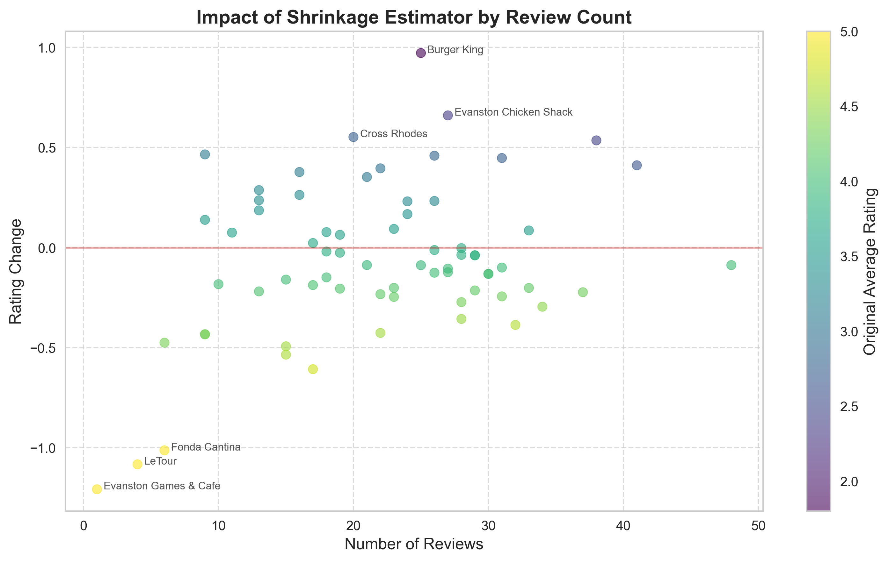
   <br>
    <em>Figure 11: Impact of Shrinkage Estimator by Review Count</em>
</div>
<div align="center">
  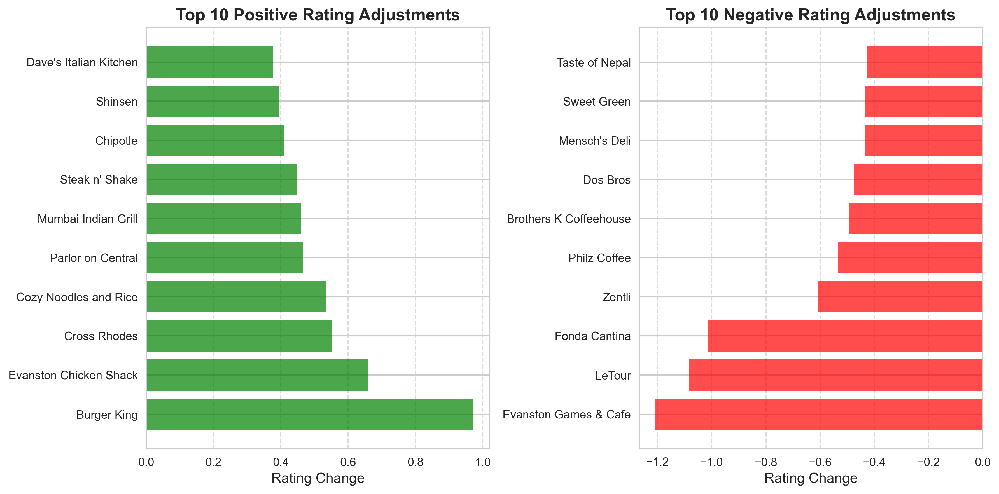
     <br>
    <em>Figure 12: Top 10 Positive and Negative Rating Adjustments after applying the shrinkage parameter</em>
</div>
 
As is shown on the graph, **Burger King** changes from 1.80 to 2.77 (+0.97); **Evanston Chicken Shack** increase from 1.90 to 2.80 (+0.90).
On the other hand, **Evanston Games & Cafe** dropped from 5.00 to 3.79 (-1.21), **Letour** dropped -1.13. Shrinkage effectively pulls extreme ratings toward the mean, particularly for restaurants with few reviews, creating a more balanced recommendation system less susceptible to outliers.

---
## 3. Content-Based Filtering

Before calculating the Euclidean distance and cosine similarity, I did the following preprocessing process: First, I encoded categorical variables such as cuisine type using one-hot encoding, and normalized numerical features like average cost and geographic coordinates with a standard scaler. This created a consistent feature space for distance calculations. For restaurant descriptions, I generated TF-IDF embeddings limited to 100 features, capturing key textual information without introducing excessive dimensionality. Then, the structured features and TF-IDF embeddings were concatenated to form a unified feature matrix, which was used to compute pairwise Euclidean and Cosine distance matrices across restaurants.

### 3.1 Distance Metrics Comparison

Using the data from `restaurants.csv`, I computed the Euclidean and Cosine distances between all restaurants after numerically encoding categorical variables. These results indicate that restaurants of the same cuisine (Chinese-Chinese) are closer in both Euclidean and Cosine space compared to restaurants of different cuisines (Chinese-Burgers). 

**Distance Metrics for Specific Restaurant Pairs:**

| Restaurant Pair | Euclidean Distance | Cosine Distance |
|-----------------|---------------------|-----------------|
| Peppercorns Kitchen - Epic Burger | 2.005 | 0.6337 |
| Peppercorns Kitchen - Lao Sze Chuan | 1.4367 | 0.3103 |

Cosine distance better captures the restaurant similarity when they share categorical attributes like cuisine type. Peppercorns Kitchen and Lao Sze Chuan (both Chinese restaurants) show a significantly lower cosine distance, indicating higher similarity, while their different price points and locations are more heavily weighted in the Euclidean measure.
 
### 3.2 Content-based Filtering Recommendation Engine
A content-based collaborative filtering engine was developed. I first identified the favorite restaurant with the highest rating for each reviewer. Then, I computed the Euclidean distance between the reviewer’s favorite restaurant and every other restaurant, and finally recommended top 10 restaurants that have the smallest Euclidean distances as the recommendations. It is shown as follows.

 **For user "Willie Jacobsen"**:
Willie Jacobsen's favorite restaurant: Jimmy Johns (American cuisine)
**Top 10 recommendations based on Euclidean Distance:**

| Rank | Restaurant              | Distance | Cuisine    |
|:----:|:-------------------------|:--------:|:----------:|
| 1    | Clarkes Off Campus        | 1.6511   | American   |
| 2    | Hecky's BBQ               | 1.7514   | American   |
| 3    | Evanston Chicken Shack    | 1.8982   | American   |
| 4    | Prairie Moon              | 1.9693   | American   |
| 5    | Edzo's Burger Shop        | 1.9990   | Burgers    |
| 6    | Philz Coffee              | 2.0056   | Coffee     |
| 7    | Pâtisserie Coralie        | 2.0231   | Coffee     |
| 8    | Mensch's Deli             | 2.0884   | Deli       |
| 9    | Le Peep                   | 2.1405   | Breakfast  |
| 10   | Fridas                    | 2.1534   | Mexican    |


### 3.3 Metrics Evaluation

To compare the effectiveness of different distance metrics, I evaluated performance based on Hit-Accuracy—the percentage of highly rated restaurants (rating ≥ 4) that appear in the recommendation list.
If there are insufficient rating records for a reviewer, a default hit-accuracy of 1 is assigned.
The overall evaluation considers two equally weighted aspects:
- How well the system recommends restaurants that the user has already rated highly (hit accuracy, 50% weight).
- How well the system avoids recommending poorly rated restaurants (50% weight).

Given:
- \( H \): Set of highly rated restaurants
- \( P \): Set of poorly rated restaurants
- \( R \): Set of recommended restaurants

**Step 1**: Hit Ratio
\[
\text{Hit Ratio} = \frac{|H \cap R|}{|H|}
\]

**Step 2**: Poorly Rated Check
\[
\text{Poorly Rated Check} =
\begin{cases}
1, & \text{if } P \cap R = \emptyset \\
0, & \text{otherwise}
\end{cases}
\]

**Step 3**: Overall Accuracy
\[
\text{Hit-Accuracy} = 0.5 \times \text{Hit Ratio} + 0.5 \times \text{Poorly Rated Check}
\]

**Step 4**: Convert to Percentage
\[
\text{Hit-Accuracy Percentage} = \text{Accuracy} \times 100
\]

By calculating the accuracy in each reviewer. I came up with the final result: Among 861 users, average accuracy for Euclidean distance is 97.17% while average accuracy for Cosine distance is 96.95%.
This aligns with our instinct. Since the features have been standardized, there's no big differences between these two methods. However, eculidian method is a **better** one than the cosine similarity method. 
The following shows an example of the calculation of the `Hit Accuracy`.

**Example 1: Willie Jacobsen**
**User Ratings:**
```
Restaurant Name                 Cuisine        Actual Rating
-------------------------------------------------------------
Jimmy Johns                    American        4
Chipotle                       Mexican         3
Steak n' Shake                 Burgers         1
```

**Euclidean Distance Results:**
```
Euclidean Distance Recommendations:
Restaurant Name                 Cuisine
----------------------------------------
Clarkes Off Campus             American       
Hecky's BBQ                    American       
Evanston Chicken Shack         American       
Prairie Moon                   American       
Edzo's Burger Shop             Burgers        
Philz Coffee                   Coffee         
Pâtisserie Coralie             Coffee         
Mensch's Deli                  Deli           
Le Peep                        Breakfast      
Fridas                         Mexican        

Top Rated Hit Accuracy: 100.00%
```

**Cosine Similarity Results:**
```
Cosine Similarity Recommendations:
Restaurant Name                 Cuisine
----------------------------------------
Evanston Chicken Shack         American       
Hecky's BBQ                    American       
Clarkes Off Campus             American       
Prairie Moon                   American       
Soban Korea                    Korean         
Edzo's Burger Shop             Burgers        
Chipotle                       Mexican        
Pâtisserie Coralie             Coffee         
Kung Fu Tea                    Bubble Tea     
Philz Coffee                   Coffee         

Top Rated Hit Accuracy: 50.00%
```
As we can know from the output, Chipotle is not rated high by the reviewer, but it exists in the Cosine Similarity Recommendations results.
<!-- 
## Case Study 2: Olya S

**User Ratings:**
```
Restaurant Name                 Cuisine        Actual Rating
-------------------------------------------------------------
Elephant & Vine                Vegetarian      5
Kabul House                    Mediterranean   5
Philz Coffee                   Coffee          5
Tapas Barcelona                Spanish         5
Kansaku                        Japanese        4
Sweet Green                    Salad           4
Jimmy Johns                    American        3
5411 Empanadas                 Spanish         2
Cross Rhodes                   Mediterranean   2
Rezas                          Mediterranean   2
Trattoria Demi                 Italian         1
Zentli                         Mexican         1
``` -->
<!-- 
**Euclidean Distance Results:**
```
Euclidean Distance Recommendations:
Restaurant Name                 Cuisine
----------------------------------------
Clarkes Off Campus             American       
Hecky's BBQ                    American       
Evanston Chicken Shack         American       
Prairie Moon                   American       
Edzo's Burger Shop             Burgers        
Philz Coffee                   Coffee         
Pâtisserie Coralie             Coffee         
Mensch's Deli                  Deli           
Le Peep                        Breakfast      
Fridas                         Mexican        

Top Rated Hit Accuracy: 100.00%
```

**Cosine Similarity Results:**
```
Cosine Similarity Recommendations:
Restaurant Name                 Cuisine
----------------------------------------
Evanston Chicken Shack         American       
Hecky's BBQ                    American       
Clarkes Off Campus             American       
Prairie Moon                   American       
Soban Korea                    Korean         
Edzo's Burger Shop             Burgers        
Chipotle                       Mexican        
Pâtisserie Coralie             Coffee         
Kung Fu Tea                    Bubble Tea     
Philz Coffee                   Coffee         

Top Rated Hit Accuracy: 50.00%
```
Philz Coffee is included in the Euclidean Distance Results.
 -->

**Conclusion**: Euclidean distance is the slightly superior metric for restaurant recommendations based on both aggregate performance and individual case studies.

---
## 4. Natural Language Analysis (Version B)

### 4.1 TF-IDF Analysis of Restaurant Descriptions
I first removed common English stop words, then computed both word frequencies and TF-IDF scores for each remaining term.
Additionally, I enriched each restaurant's description by appending its cuisine type, and applied TF-IDF analysis to extract distinctive and informative terms.

**Restaurants with highest TF-IDF score for specific terms:**

| Term | Top Restaurant | TF-IDF Score |
|------|---------------|--------------|
| 'cozy' | Taste of Nepal | 0.2890 |
| 'Chinese' | Lao Sze Chuan | 0.4576 |

"Cozy" has the highest TF-IDF score in Taste of Nepal, suggesting that this term is particularly distinctive in its description and may reflect a warm or intimate dining atmosphere emphasized by the restaurant. "Chinese" yields the highest score in Lao Sze Chuan, which aligns with its cuisine type. 

This effectively identifies restaurants where specific descriptive terms are most distinctive, supporting keyword-based search functionality.

### 4.2 TF-IDF Vector-Based Recommendations

Using the 100 most common words in restaurant descriptions, TF-IDF vectors were created for each restaurant and distances computed between them.

**TF-IDF distances between restaurant pairs:**

| Restaurant Pair | TF-IDF Distance |
|-----------------|-----------------|
| Burger King - Edzo's Burger Shop | 0.5197 |
| Burger King - Oceanique | 0.9997 |
| Lao Sze Chuan - Kabul House | 0.7273 |

According to the rule illustrated in Table 9, Burger King is deemed more similar to Edzo’s Burger Shop than to Oceanique, as indicated by a shorter Euclidean distance and a higher cosine similarity. This is likely because both Burger King and Edzo’s specialize in burgers, while Oceanique focuses on seafood, making it less similar in content.
<div align="center">
  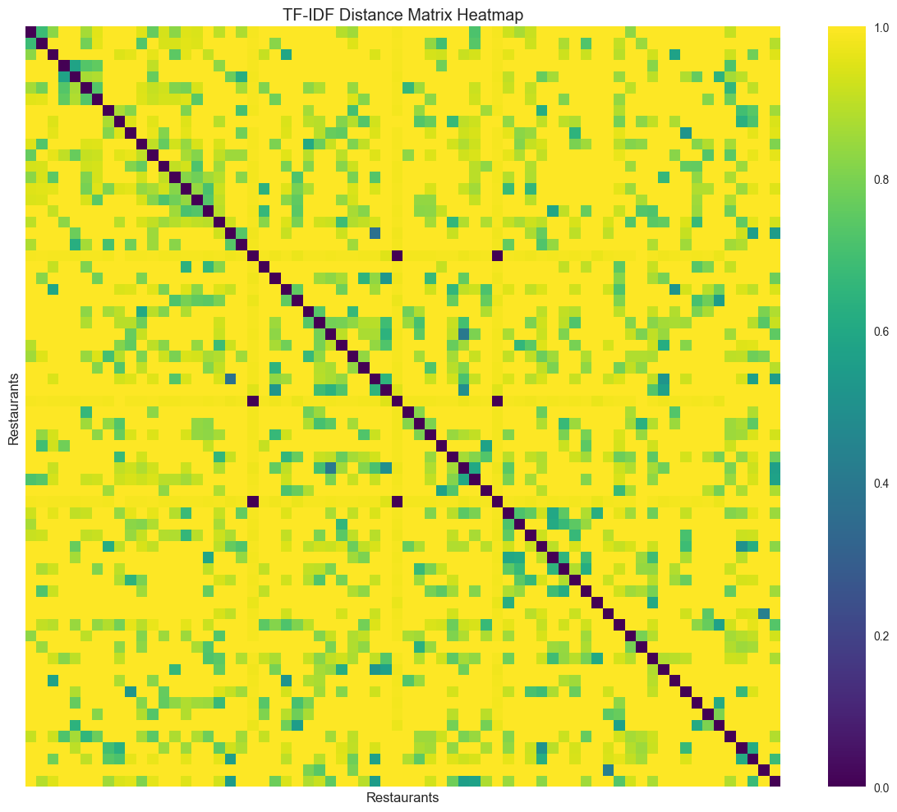
     <br>
    <em>Figure 13: TF-IDF Distance Matrix Heatmap </em>
</div>
 
---

## References

1. Lecture 4: Recommender Systems - Shrinkage Estimator, Northwestern University STAT 415
2. Sklearn Documentation: Clustering methods and distance metrics
3. Restaurant Reviews Dataset, Evanston, IL (2016-2022)


## Appendix A


| Cuisine Type          | Rank  | Restaurant                      | Rating | Reviews | Popularity Score |
| :-------------------- | :---- | :------------------------------ | :----- | :------ | :--------------- |
| Vegetarian            | Top 1 | Elephant & Vine                 | 3.96   | 27      | 3.9630           |
| Jamaican              | Top 1 | Claire's Korner                  | 4.00   | 27      | 4.0000           |
| Thai                  | Top 1 | Nakorn                           | 4.22   | 23      | 1.5902           |
| Thai                  | Top 2 | Cozy Noodles and Rice            | 2.39   | 38      | 1.4918           |
| Korean                | Top 1 | Soban Korea                      | 4.18   | 22      | 2.3000           |
| Korean                | Top 2 | Papa Bop                         | 4.00   | 18      | 1.8000           |
| Chocolate             | Top 1 | Kilwin's                         | 4.62   | 32      | 2.7925           |
| Chocolate             | Top 2 | Leonidas Cafe Chocolaterie       | 3.90   | 21      | 1.5472           |
| American              | Top 1 | Jimmy Johns                      | 3.77   | 26      | 0.6087           |
| American              | Top 2 | Hecky's BBQ                      | 3.42   | 24      | 0.5093           |
| American              | Top 3 | Prairie Moon                     | 3.57   | 23      | 0.5093           |
| South Asian           | Top 1 | Shangri-La Evanston              | 4.00   | 26      | 1.1304           |
| South Asian           | Top 2 | Taste of Nepal                   | 4.55   | 22      | 1.0870           |
| South Asian           | Top 3 | Mumbai Indian Grill              | 2.81   | 26      | 0.7935           |
| Bubble Tea            | Top 1 | Tealicious                       | 4.44   | 34      | 2.4355           |
| Bubble Tea            | Top 2 | Kung Fu Tea                      | 3.82   | 28      | 1.7258           |
| Japanese              | Top 1 | Table to Stix Ramen              | 4.50   | 28      | 0.8129           |
| Japanese              | Top 2 | Tomo Japanese Street Food        | 4.03   | 30      | 0.7806           |
| Japanese              | Top 3 | Kansaku                          | 3.83   | 29      | 0.7161           |
| BBQ                   | Top 1 | Soul & Smoke                     | 3.56   | 9       | 3.5556           |
| Chinese               | Top 1 | Joy Yee Noodle                   | 4.29   | 31      | 1.5114           |
| Chinese               | Top 2 | Peppercorns Kitchen              | 3.55   | 33      | 1.3295           |
| Chinese               | Top 3 | Lao Sze Chuan                    | 3.29   | 24      | 0.8977           |
| Mexican               | Top 1 | Taco Diablo                      | 4.30   | 37      | 1.2231           |
| Mexican               | Top 2 | Chipotle                         | 2.66   | 41      | 0.8385           |
| Mexican               | Top 3 | Zentli                           | 4.76   | 17      | 0.6231           |
| Mediterranean         | Top 1 | Kabul House                      | 3.97   | 31      | 1.5000           |
| Mediterranean         | Top 2 | Sarah's Brick Oven               | 3.78   | 18      | 0.8293           |
| Mediterranean         | Top 3 | Cross Rhodes                     | 2.75   | 20      | 0.6707           |
| Irish                 | Top 1 | Celtic Knot Public House         | 3.92   | 25      | 3.9200           |
| Salad                 | Top 1 | Picnic                           | 4.11   | 19      | 2.7857           |
| Salad                 | Top 2 | Sweet Green                      | 4.33   | 9       | 1.3929           |
| Breakfast             | Top 1 | Le Peep                          | 4.13   | 23      | 4.1304           |
| Brewery               | Top 1 | Sketchbook Brewing Co            | 4.32   | 28      | 4.3214           |
| Italian               | Top 1 | Campagnola                       | 4.00   | 48      | 1.8641           |
| Italian               | Top 2 | Trattoria DOC                    | 3.27   | 26      | 0.8252           |
| Italian               | Top 3 | Dave's Italian Kitchen           | 3.12   | 16      | 0.4854           |
| Ice Cream             | Top 1 | Parlor on Central                | 3.11   | 9       | 3.1111           |
| Spanish               | Top 1 | Tapas Barcelona                  | 4.21   | 29      | 2.1404           |
| Spanish               | Top 2 | 5411 Empanadas                   | 3.75   | 28      | 1.8421           |
| French                | Top 1 | LeTour                           | 5.00   | 4       | 5.0000           |
| Seafood               | Top 1 | Oceanique                        | 3.79   | 19      | 3.7895           |
| Coffee                | Top 1 | Pâtisserie Coralie                | 4.03   | 30      | 1.9836           |
| Coffee                | Top 2 | Philz Coffee                     | 4.60   | 15      | 1.1311           |
| Coffee                | Top 3 | Brothers K Coffeehouse           | 4.53   | 15      | 1.1148           |
| Burgers               | Top 1 | Steak n' Shake                   | 2.74   | 31      | 0.9043           |
| Burgers               | Top 2 | Epic Burger                      | 3.10   | 21      | 0.6915           |
| Burgers               | Top 3 | Edzo's Burger Shop               | 3.71   | 17      | 0.6702           |
| Pizza                 | Top 1 | Union Pizzeria                   | 4.21   | 33      | 3.0217           |
| Pizza                 | Top 2 | Panino's Pizzeria                 | 3.46   | 13      | 0.9783           |
| Deli                  | Top 1 | Mensch's Deli                    | 4.33   | 9       | 4.3333           |

 